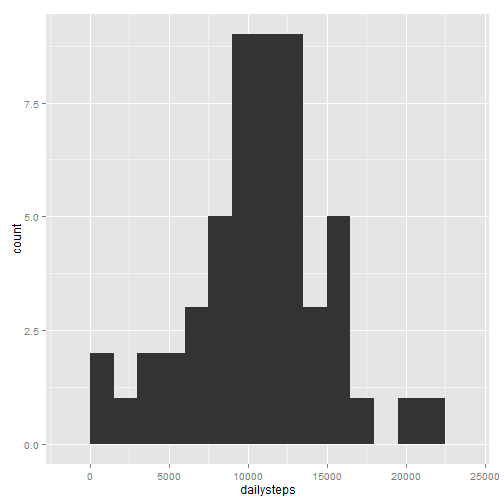
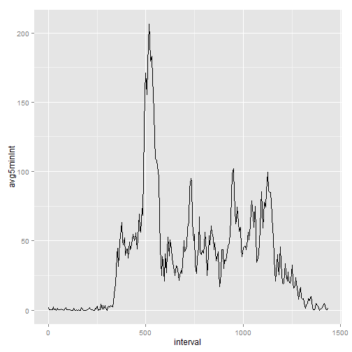
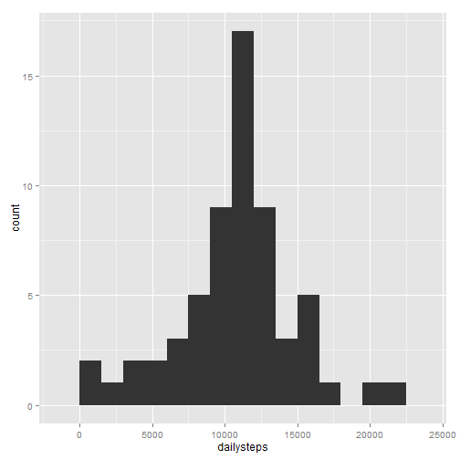
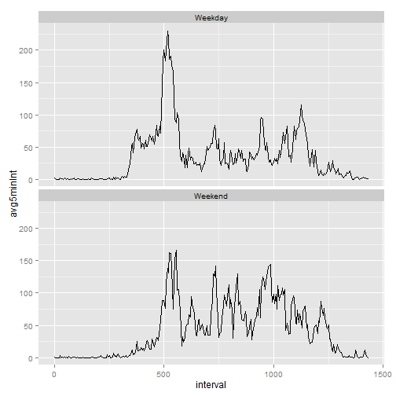

--- title: "Reproducible Research: Peer Assessment 1" output: html_document: 
keep_md: true ---


## Loading and preprocessing the data 

```r
library(dplyr) 
library(ggplot2) 
library(lubridate)

fitdata <- read.csv("activity.csv")

fitdata <- mutate(fitdata, interval = 60 * floor(interval/100) + interval - 100 *                      floor(interval/100), datetime = ymd(date) + 60*interval) 
```

## What is mean total number of steps taken per day? 

```r
stepsPerDay <- group_by(fitdata, date) %>% summarize("dailysteps" = sum(steps))

h <- ggplot(stepsPerDay, aes(dailysteps)) + geom_histogram(binwidth = 1500) 
h
```

 

```r
avgDailySteps <- mean(stepsPerDay$"dailysteps", na.rm = 1)
medDailySteps <- median(stepsPerDay$"dailysteps", na.rm = 1)
```

Mean number of steps taken each day:

```r
avgDailySteps 
```

```
## [1] 10766.19
```

Median number of steps taken each day:

```r
medDailySteps 
```

```
## [1] 10765
```


## What is the average daily activity pattern? 

```r
avgSteps5min <- group_by(fitdata, interval) %>%
  na.omit() %>%
  summarize("avg5minInt" = mean(steps))

t <- ggplot(avgSteps5min, aes(interval, avg5minInt)) + geom_line()
t
```

 


The 5-minute interval that, on average, contains the maximum number of steps:

```r
maxSteps <- summarize(avgSteps5min, maxi = max(avg5minInt))
maxInt <- as.numeric(filter(avgSteps5min, avg5minInt == as.numeric(maxSteps)) %>% select(interval))
quotient <- maxInt %/% 60
remainder <- maxInt %% 60
paste(quotient, remainder, sep=":")
```

```
## [1] "8:35"
```


## Imputing missing values
The total number of periods with missing step data is:

```r
sum(!complete.cases(fitdata))
```

```
## [1] 2304
```

My strategy to fill in the missing data is to use the 5 min interval average to submit in place of NA, which is accomllished by this code:

```r
filledData <- arrange(left_join(fitdata, avgSteps5min), datetime)
```

```
## Joining by: "interval"
```

```r
bad <- is.na(filledData$steps)
filledData[bad,"steps"] <- filledData[bad, "avg5minInt"]
filledData <- select(filledData, steps:interval)
```


```r
stepsPerDaynoNA <- group_by(filledData, date) %>% summarize("dailysteps" = sum(steps))

h <- ggplot(stepsPerDaynoNA, aes(dailysteps)) + geom_histogram(binwidth = 1500) 
h
```

 

```r
avgDailyStepsnoNA <- mean(stepsPerDaynoNA$"dailysteps", na.rm = 1)
medDailyStepsnoNA <- median(stepsPerDaynoNA$"dailysteps", na.rm = 1)
```


Mean number of steps taken each day (NAs replaced with time period average):

```r
avgDailyStepsnoNA
```

```
## [1] 10766.19
```


Median number of steps taken each day (NAs replaced with time period average):

```r
medDailyStepsnoNA
```

```
## [1] 10766.19
```


Note that while the mean is unchanged from the case where we ignore the missing data, the median has changede, due to the affect of additional data points.


## Are there differences in activity patterns between weekdays and weekends?

```r
filledData$weekperiod <- ifelse(wday(filledData$date) %in% c(1, 7), "Weekend", "Weekday")
```


## What are the average weekday and weekend activity patterns?
Plots of avg steps per 5 minute interval broken down by weekdays and weekends:

```r
avgSteps5minW <- group_by(filledData, weekperiod, interval) %>% summarize("avg5minInt" = mean(steps))

t <- ggplot(avgSteps5minW, aes(interval, avg5minInt, group = weekperiod)) + facet_wrap(~weekperiod, 2, 1) + geom_line()
t
```

 
